<div align="center">

# 🤖 Claude AI Integration Guide


**Smart Trader — XAUUSD Autonomous Trading System**

*Powered by Claude Opus 4.6 as Primary Decision Engine*

---

**Author:** Gifari K Suryo — CEO & Founder, Lead R&D
**Organization:** PT Surya Inovasi Prioritas (SURIOTA)
**Date:** February 22, 2026
**Version:** v1.0.0-beta

</div>

---

## 📋 Table of Contents

1. [Overview](#1-overview)
2. [Trading Philosophy — Legendary Trader Principles](#2-trading-philosophy--legendary-trader-principles)
3. [Why Claude Opus 4.6](#3-why-claude-opus-46)
4. [Integration Architecture](#4-integration-architecture)
5. [Entry Validation](#5-entry-validation)
6. [Exit Optimization](#6-exit-optimization)
7. [Signal Reference Table](#7-signal-reference-table)
8. [Prompt Engineering Principles](#8-prompt-engineering-principles)
9. [Configuration Reference](#9-configuration-reference)
10. [Error Handling](#10-error-handling)
11. [Cost & Performance](#11-cost--performance)
12. [References](#12-references)
13. [Copyright](#13-copyright)

---

## 1. Overview

Smart Trader is a **split-architecture** autonomous trading system for XAUUSD (Gold/USD). The system divides responsibilities clearly between a Python engine and Claude AI, ensuring each component does what it does best.

### 🐍 Python Engine — "The Body"

| Responsibility | Module |
|---|---|
| Connect to MetaTrader 5 and fetch real-time price data | `mt5_client.py` |
| Calculate technical indicators (RSI, EMA, ATR, MACD) | `indicators.py` |
| Detect SMC zones (Order Blocks, FVG, BOS, CHoCH, etc.) | `zone_detector.py` |
| Scan for trading setups near price | `scanner.py` |
| Execute buy/sell/close orders via MT5 API | `executor.py` |
| Manage risk: position sizing, BE trigger, trailing stop | `executor.py` |
| Enforce session guards, loss cooldowns, max positions | `main.py` |
| Format and display colored terminal output | `console_format.py` |

### 🤖 Claude AI — "The Brain"

| Responsibility | When Called |
|---|---|
| **Entry Validation**: evaluate setup quality, decide LONG / SHORT / NO_TRADE | When a valid setup is detected near price |
| **Exit Optimization**: decide HOLD / TAKE_PROFIT / TIGHTEN for open positions | On each review cycle for positions with profit |
| Assign confidence score (0.0–1.0) to entries | Per entry validation request |
| Provide brief reasoning for every decision | Per every Claude call |
| Suggest refined SL/TP values if needed | Per entry validation request |

### ❌ What Claude Does NOT Do

- Fetch market data or call any external APIs
- Execute orders or interact with MetaTrader 5
- Calculate position sizing, margin, or risk percentage
- Manage trailing stops or breakeven logic
- Run continuously on every scan cycle

> **Design Philosophy:** Python handles deterministic, rule-based work with zero latency. Claude handles qualitative, contextual market reasoning that benefits from language model intelligence. Claude is called *only* when a setup is already identified — never for routine scanning.

---

## 2. Trading Philosophy — Legendary Trader Principles

Smart Trader's Claude AI is designed to reason like the world's greatest traders. Every entry and exit decision is guided by principles distilled from 8 legendary traders who collectively generated billions in profit across forex, commodities, and equities.

> **CLAUDE IDENTITY:** When evaluating trades, Claude operates as an elite institutional trader — combining the macro conviction of Soros, the risk discipline of Kovner, the systematic execution of Simons, and the patience of Lipschutz. This is not casual retail trading; this is institutional-grade decision making on every single call.

### 2.1 The 8 Masters and Their Rules

| # | Trader | Core Principle | Rule Applied to Smart Trader |
|---|--------|---------------|------------------------------|
| 1 | **George Soros** | Reflexivity — self-reinforcing feedback loops | When BOS + FVG + OB align (reflexive confluence), trade with high conviction; exit immediately on CHoCH — the feedback loop is broken |
| 2 | **Paul Tudor Jones** | Defense first — capital preservation paramount | Never override SL; minimum acceptable R:R; always know max loss before entering |
| 3 | **Stanley Druckenmiller** | Asymmetric bets — it's not win rate, it's how much | Size up on high-confluence setups; most profits come from a few great trades, not many mediocre ones |
| 4 | **Jim Simons** | Systematic execution — never override the model | Execute every qualifying signal without discretion; process over outcome; trust the validated edge |
| 5 | **Bruce Kovner** | 1-2% risk rule — SL determines position size | SL at technical invalidation (below OB for LONG, above OB for SHORT); never widen a stop |
| 6 | **Richard Dennis** | Turtle Trading — mechanical trend following | BOS = breakout signal; enter on pullback to OB/FVG; exit only on CHoCH; let the trend run |
| 7 | **Bill Lipschutz** | Patience + asymmetric R:R | Skip mediocre setups; wait for A+ confluence; sitting on hands is a valid position |
| 8 | **Takashi Kotegawa** | Extreme discipline — cut losses instantly | Stick to the plan with zero emotion; if the level fails, the trade is wrong — accept and move on |

### 2.2 Unified Master Rules (Embedded in Claude Prompts)

These 8 principles are distilled into actionable rules that Claude follows on every trade decision:

```
MASTER RULES — Think like Soros, Kovner, PTJ, Simons, Druckenmiller, Dennis, Lipschutz, Kotegawa:
1. CONVICTION (Soros): When BOS+OB+FVG align in same direction = reflexive confluence → high confidence
2. DEFENSE (PTJ/Kovner): Capital preservation first; SL at OB invalidation; never widen stops
3. ASYMMETRY (Druckenmiller): It's not win rate — it's profit when right vs loss when wrong
4. SYSTEMATIC (Simons): Trust the signals; no emotional override; process > outcome
5. PATIENCE (Lipschutz): Skip weak setups; A+ confluence only; sitting out IS a position
6. TREND (Dennis): Trade with structure — BOS confirms trend, CHoCH signals reversal
7. DISCIPLINE (Kotegawa): If the level fails, the trade is wrong — zero emotion, zero exceptions
8. LET WINNERS RUN (Dennis/Lipschutz): Don't exit winners early; trail and let structure decide
```

### 2.3 How Principles Map to Entry Decisions

| Scenario | Master Rule Applied | Expected Decision |
|----------|-------------------|-------------------|
| BOS + OB + FVG + EMA aligned | Soros (reflexive confluence) + Druckenmiller (asymmetric) | HIGH confidence LONG/SHORT |
| Only 1-2 weak signals, no confluence | Lipschutz (patience) | NO_TRADE — skip, wait for A+ setup |
| Strong signals BUT counter to H1 EMA | PTJ (defense first) + Dennis (trade with trend) | NO_TRADE — counter-trend = high risk |
| Setup near ATH with no resistance | Soros (reflexivity intact) + Dennis (trend following) | Consider LONG if BOS fresh + OB valid |
| CHoCH appearing against position direction | Soros (loop broken) + Kotegawa (cut instantly) | Flag structural concern, reduce confidence |
| Perfect setup but RSI extreme (>85/<15) | PTJ (defense) + Kovner (technical invalidation) | NO_TRADE or very low confidence |

### 2.4 How Principles Map to Exit Decisions

| Scenario | Master Rule Applied | Expected Action |
|----------|-------------------|----------------|
| Position profitable, trend intact | Dennis (let it run) + Lipschutz (patience) | HOLD — never exit winners prematurely |
| Profit > 15pt, momentum reversing (RSI dropping from OB) | Soros (feedback loop breaking) | TAKE_PROFIT — reflexive loop ending |
| Profit > 8pt, structure weakening but not broken | Druckenmiller (lock asymmetric gains) | TIGHTEN — protect gains, stay in trade |
| Position underwater (negative P/L) | PTJ (defense) + Kovner (SL handles it) | HOLD — let SL do its job, no emotional exit |
| Small profit, no clear signal either way | Simons (systematic) + Lipschutz (patience) | HOLD — let the trade develop |

### 2.5 Key Psychological Rules for Claude

1. **No fear of missing out (FOMO):** If the setup doesn't meet A+ criteria, NO_TRADE. There will always be another setup. (Lipschutz)
2. **No revenge trading mindset:** If the last trade was a loss, evaluate the NEXT setup purely on its own merit. (Simons — systematic, no emotion)
3. **No premature profit-taking:** A position at +10pt with trend intact is NOT a reason to exit. Let it run. (Dennis)
4. **No loss aversion on exits:** If Claude says TAKE_PROFIT because momentum is truly reversing, commit fully. Don't "hold a little longer hoping." (Kotegawa — discipline)
5. **Confidence reflects conviction, not certainty:** 0.80 means "strong A+ setup with aligned confluence" (Soros-level conviction). 0.50 means "marginal, not worth the risk." (Druckenmiller — skip marginal bets)

---

## 3. Why Claude Opus 4.6

### ✅ Primary Choice: Claude Opus 4.6

Claude Opus 4.6 was selected as the sole AI decision engine for the following reasons:

| Criterion | Claude Opus 4.6 |
|---|---|
| **Nuanced Reasoning** | Handles multi-factor SMC confluence analysis with contextual judgment |
| **SMC Domain Knowledge** | Understands Smart Money Concepts (BOS, CHoCH, OB, FVG, LiqSweep) natively |
| **Instruction Following** | Reliably returns pure JSON with `--max-turns 1`; no tool calls, no preamble |
| **Structured Output** | Consistent `{"decision":..., "confidence":..., "reason":..., "sl":..., "tp":...}` format |
| **Low Latency per Call** | Fast enough for live trading when called selectively (not every 30s scan) |
| **Context Window** | Large enough to include full market snapshot + signals + recent context |
| **Restraint** | When told to HOLD by default, Opus 4.6 genuinely defaults to HOLD rather than finding reasons to act |

### 🔄 Alternatives Considered

| Model | Reason Not Selected |
|---|---|
| GPT-4o (OpenAI) | Slightly less consistent JSON discipline; no native Claude Code CLI integration |
| Claude Haiku / Sonnet | Lower reasoning depth for complex SMC confluence scenarios |
| Local LLM (Llama 3, Mistral) | No reliable JSON guarantee without fine-tuning; latency unpredictable |
| Rule-based scoring only | Cannot weigh nuanced context (e.g., "RSI 72 in uptrend" vs "RSI 72 at resistance") |
| Claude Opus 4.5 | Superseded by Opus 4.6 with improved instruction following |

### 🧠 The Core Argument

Traditional algorithmic trading filters signals with fixed thresholds. Smart Money Concepts, however, require *interpretation* — a BOS near a Premium zone in a weak trend is very different from a BOS in a strong trend at Discount. Claude Opus 4.6 can hold that context and make the distinction reliably, while Python enforces the hard safety rails regardless.

---

## 4. Integration Architecture

### High-Level Flow

```mermaid
flowchart TD
    A[MetaTrader 5\nLive Price Feed] --> B[mt5_client.py\nData Fetcher]
    B --> C[indicators.py\nRSI · EMA · ATR · MACD]
    C --> D[zone_detector.py\nSMC Zone Detection]
    D --> E{scanner.py\nSetup Near Price?}

    E -- No Setup --> F[Wait 30s\nNext Scan]
    E -- Setup Found --> G[Build Prompt\nmarket snapshot + signals]

    G --> H[claude_validator.py\nsubprocess call]
    H --> I["claude CLI\n--model claude-opus-4-6\n--max-turns 1 -p"]
    I --> J[Anthropic API\nClaude Opus 4.6]
    J --> K[JSON Response\ndecision · confidence · sl · tp]
    K --> H

    H -- NO_TRADE\nor confidence < 0.70 --> F
    H -- LONG/SHORT\nconfidence ≥ 0.70 --> L[executor.py\nPlace Order via MT5]

    L --> M[Position Open\nBE · Trail · ScratchExit]
    M --> N{Exit Review\nCycle}
    N --> O[Build Exit Prompt\nP&L · RSI · session]
    O --> I
    J --> P[JSON Response\nHOLD · TAKE_PROFIT · TIGHTEN]
    P --> H
    H --> Q[executor.py\nModify or Close Position]
```



### Subprocess Call Detail


### Environment Isolation

Claude Code CLI injects `CLAUDECODE` and `CLAUDE_CODE_SESSION` environment variables that interfere with subprocess calls (causing nested session conflicts on Windows). The validator explicitly removes these:

```python
env = os.environ.copy()
env.pop("CLAUDECODE", None)
env.pop("CLAUDE_CODE_SESSION", None)
subprocess.run([...], env=env, ...)
```

> ⚠️ **Critical:** Using `os.environ.pop()` at module startup alone is NOT sufficient on Windows. The env copy + pop pattern must be applied at each subprocess call.

---

## 5. Entry Validation

### 4.1 When Entry Validation is Triggered

Entry validation occurs when all of the following Python-side gates pass:

- ✅ At least **3 SMC signals** detected (`min_signals = 3`)
- ✅ Setup zone is within **50 points** of current price
- ✅ Current session is not `OFF_HOURS` (17:00–24:00 UTC)
- ✅ No **loss cooldown** active (30 min after any losing trade)
- ✅ No **SL-hit directional cooldown** active for this direction (30 min after SL)
- ✅ Open positions below maximum (`max_positions = 3`)
- ✅ **H1 EMA(50) trend** is not opposing the proposed direction

Only then is Claude called. This ensures Claude spends reasoning capacity on genuinely viable setups.

### 4.2 Entry Prompt Template

```
XAUUSD TRADE VALIDATION — all data already provided, NO tool calls needed.
Respond with ONLY the JSON decision object, nothing else.

MARKET SNAPSHOT:
Price: {price} | Spread: {spread}pt | ATR: {atr:.1f}pt
Session: {session} | H1: {h1_structure} | EMA(50): {ema_trend}
RSI(14): {rsi:.1f} | P/D: {pd_zone}

PROPOSED TRADE:
Direction: {direction}
Zone: {zone_type} @ {zone_level}  (distance: {distance:.1f}pt)
M15 Confirm: {m15_conf}
OTE: {ote}
Signals ({signal_count}): {signals}
SL: {sl:.2f} | TP: {tp:.2f} | RR: {rr:.1f}
Lot: {lot:.2f} | Est.margin: ~$50

RECENT CONTEXT:
{context}

RULES (mandatory):
- RR ~1.7 is NORMAL for this system (3x ATR SL, 5x ATR TP). Do NOT reject for low RR.
- RSI 60-80 is normal in XAUUSD trends. Only reject RSI above 85 or below 15.
- You are the PRIMARY decision maker. Evaluate signal quality and confluence freely.
- REJECT only if: SL/TP values are clearly wrong (e.g. SL above entry for LONG).

Respond ONLY with valid JSON:
{"decision":"LONG or SHORT or NO_TRADE","confidence":0.0-1.0,"reason":"<20 words","sl":...,"tp":...}
```

### 4.3 Entry Response Format

```json
{
  "decision": "LONG",
  "confidence": 0.82,
  "reason": "BOS+OB at discount, EMA aligned, M15 confirms",
  "sl": 2895.00,
  "tp": 2947.00
}
```

| Field | Type | Description |
|---|---|---|
| `decision` | string | `LONG`, `SHORT`, or `NO_TRADE` |
| `confidence` | float | 0.0–1.0 quality score |
| `reason` | string | ≤20 word rationale |
| `sl` | float | Suggested stop loss price |
| `tp` | float | Suggested take profit price |

### 4.4 Entry Decision Flow

```mermaid
flowchart TD
    A[Claude returns JSON] --> B{decision == NO_TRADE?}
    B -- Yes --> C[Skip trade\nLog reason]
    B -- No --> D{confidence >= 0.70?}
    D -- No --> E[Skip trade\nLow confidence]
    D -- Yes --> F{SL/TP sanity check\nby Python}
    F -- Fail --> G[Skip trade\nInvalid SL/TP]
    F -- Pass --> H[Place order via MT5\nwith Claude's sl + tp]
    H --> I[Log: LONG/SHORT\nConfidence · Reason]
```



> **Minimum confidence threshold: 0.70** — below this, the trade is skipped regardless of direction. This prevents execution on Claude's uncertain or marginal calls.

---

## 6. Exit Optimization

### 5.1 When Exit Review is Triggered

Exit review runs on a per-position basis during each main loop cycle. It is called only when:

- ✅ Position has been open for at least **15 minutes** (avoids reactive closes)
- ✅ Position has **any measurable profit** (P/L > 0 points)
- ✅ Not currently in a mechanical exit stage (BE just triggered, etc.)

The automated risk management system (BE trigger, trailing stop, scratch exit, stale tighten) runs *independently* of Claude and handles loss protection without Claude's involvement.

### 5.2 Exit Prompt Template

```
XAUUSD SMART EXIT ANALYSIS — all data provided, NO tool calls needed.
You are a PROFIT OPTIMIZER. Maximize profit from this open position.

MARKET NOW:
Price: {price} | ATR: {atr:.1f}pt | Session: {session} | EMA(50): {ema_trend}
RSI(14): {rsi:.1f} | P/D: {pd_zone}
Nearby signals: {nearby_signals}

OPEN POSITION:
Direction: {direction} | Entry: {entry:.2f} | P/L: {pnl_pts:+.1f}pt (${pnl_usd:+.2f})
SL: {sl:.2f} | TP: {tp:.2f} (remaining: {tp_remaining:.0f}pt) | Duration: {duration_min:.0f}min
Stage: {stage}

RULES:
- Default is HOLD. Need STRONG reason to override.
- TAKE_PROFIT only: profit > 15pt AND momentum clearly reversing
- TIGHTEN: profit > 8pt, momentum weakening
- If underwater (P/L negative): ALWAYS HOLD
- If profit < 8pt: ALWAYS HOLD
```

### 5.3 Exit Response Format

```json
{"action":"HOLD","reason":"EMA bullish, RSI not extreme"}
```
```json
{"action":"TAKE_PROFIT","reason":"RSI dropping from 78, momentum fading"}
```
```json
{"action":"TIGHTEN","new_sl":2910.50,"reason":"Lock 60% profit, structure weakening"}
```

### 5.4 Exit Action Trigger Conditions

| Action | Python-Side Gate | When Claude Should Choose It |
|---|---|---|
| `HOLD` | Always allowed (default) | Trend intact, no reversal signals, profit building |
| `TAKE_PROFIT` | Requires profit > 3 points (safety gate) | RSI extreme reversal, strong opposing signal, session closing against position |
| `TIGHTEN` | Requires profit > 8 points | Momentum weakening, structure slightly broken, want to lock partial gains |

> ⚠️ **Critical Rule:** Claude is **NEVER** asked to close losing positions. The automated system (BE trigger → breakeven, scratch exit → flat close, stale tighten → SL reduction) handles all downside protection. Claude's sole job is to optimize exits from profitable positions.

### 5.5 Automated vs Claude Exit Stages

```mermaid
flowchart LR
    subgraph Automated["🐍 Automated (Python)"]
        A1["BE Trigger\n0.7× SL dist profit"] --> A2["Move SL to Entry\nRisk = 0"]
        A2 --> A3["Trail Stop\n40% of peak profit"]
        A4["Scratch Exit\n< 5pt after 60 min"]
        A5["Stale Tighten\n< 50% SL dist after 90 min\n→ Halve SL risk"]
    end

    subgraph Claude["🤖 Claude (Profit Optimizer)"]
        C1["HOLD\nDefault"]
        C2["TAKE_PROFIT\nProfit > 15pt\n+ reversal signal"]
        C3["TIGHTEN\nProfit > 8pt\n+ weakening momentum"]
    end

    Automated -- "Risk protected\nBE achieved" --> Claude
    Claude -- "Action decision" --> EX["executor.py\nModify or Close"]
```



---

## 7. Signal Reference Table

These signals are detected by `zone_detector.py` and `scanner.py`, then passed to Claude in the entry prompt.

| Signal | Full Name | Description | Tier |
|---|---|---|---|
| **BOS** | Break of Structure | Price breaks a prior swing high/low, signaling trend continuation | Tier 1 ⭐⭐⭐ |
| **OB** | Order Block | Last bullish/bearish candle before a strong impulsive move; institutional entry zone | Tier 1 ⭐⭐⭐ |
| **LiqSweep** | Liquidity Sweep | Price sweeps above swing high or below swing low to grab stops, then reverses | Tier 1 ⭐⭐⭐ |
| **FVG** | Fair Value Gap | Three-candle imbalance where middle candle has no overlap; price tends to fill | Tier 2 ⭐⭐ |
| **CHoCH** | Change of Character | Counter-trend BOS signaling potential reversal in market direction | Tier 2 ⭐⭐ |
| **Breaker** | Breaker Block | Failed OB that price has broken through; now acts as opposite-direction zone | Tier 2 ⭐⭐ |
| **M15** | M15 Confirmation | Price action confirmation on the 15-minute chart (engulfing, pin bar, wick rejection) | Tier 2 ⭐⭐ |
| **OTE** | Optimal Trade Entry | Fibonacci 61.8–79% retracement zone within an identified swing; premium entry location | Tier 2 ⭐⭐ |
| **Discount** | Discount Zone | Price is below 50% of the swing range; favorable buy territory in uptrend | Tier 3 ⭐ |
| **Premium** | Premium Zone | Price is above 50% of the swing range; favorable sell territory in downtrend | Tier 3 ⭐ |

**Tier Definitions:**
- **Tier 1** — High-probability, standalone signal. Strong confluence when combined.
- **Tier 2** — Supporting signal. Validates and strengthens Tier 1 signals.
- **Tier 3** — Contextual filter. Confirms directional bias only.

> **Minimum signals required for Claude call:** 3 (any combination). This ensures Claude reviews only meaningful setups, not isolated signals.

---

## 8. Prompt Engineering Principles

Six core principles guide how prompts are written for this system:

### Principle 1: No Tool Calls — Data Provided Upfront

```
XAUUSD TRADE VALIDATION — all data already provided, NO tool calls needed.
```

Every prompt opens with this statement. Claude Opus 4.6 has access to web search and other tools via Claude Code CLI. If not instructed otherwise, it may attempt to fetch live price data or news — adding latency and unpredictability. By stating data is already provided, Claude is anchored to the snapshot in the prompt.

**Result:** Consistent sub-5-second response time per call, no external API calls from Claude.

---

### Principle 2: Explicit Output Contract — JSON Only

```
Respond ONLY with valid JSON:
{"decision":"LONG or SHORT or NO_TRADE","confidence":0.0-1.0,"reason":"<20 words","sl":...,"tp":...}
```

The exact JSON schema is specified in the prompt with field names and value types. No markdown, no explanation, no preamble. This eliminates the need for regex extraction and makes `json.loads()` reliable.

**Result:** Zero JSON parsing failures in production across 200+ calls.

---

### Principle 3: Correct Domain Calibration — Override LLM Defaults

```
RULES (mandatory):
- RR ~1.7 is NORMAL for this system (3x ATR SL, 5x ATR TP). Do NOT reject for low RR.
- RSI 60-80 is normal in XAUUSD trends. Only reject RSI above 85 or below 15.
```

Language models trained on general finance content have biases: "low RR is bad," "RSI above 70 is overbought." XAUUSD in trending markets regularly runs RSI 70–85. Without correction, Claude would reject valid trend-following setups. These rules recalibrate Claude to the actual statistical behavior of this instrument.

**Result:** Claude stopped blocking valid momentum entries that were being rejected due to generic finance heuristics.

---

### Principle 4: Role Assignment — Primary Decision Maker

```
You are the PRIMARY decision maker. Evaluate signal quality and confluence freely.
```

This is not flattery — it is a behavioral instruction. Without this, Claude may hedge aggressively ("I'm just an AI and cannot provide financial advice"). By explicitly assigning the decision role, Claude engages with the prompt as a market analyst rather than as a cautious assistant.

**Result:** Higher confidence scores on strong setups, clearer NO_TRADE decisions on weak ones.

---

### Principle 5: Selective Rejection Criteria

```
REJECT only if: SL/TP values are clearly wrong (e.g. SL above entry for LONG).
```

Rather than giving Claude open-ended rejection latitude, hard mechanical errors (SL above entry for a long) are the primary REJECT trigger. Signal quality and confluence are evaluated freely. This prevents Claude from inventing reasons to reject setups that Python has already validated through its own multi-layer filter.

**Result:** Balanced NO_TRADE rate (~20–30%) — neither trigger-happy nor rubber-stamp approver.

---

### Principle 6: Exit Default Bias — HOLD Unless Strong Reason

```
- Default is HOLD. Need STRONG reason to override.
- If underwater (P/L negative): ALWAYS HOLD
- If profit < 8pt: ALWAYS HOLD
```

Exit prompts are phrased with explicit HOLD bias. This prevents Claude from closing profitable positions prematurely when momentum is simply pausing. The automated system (trailing stop, BE) handles risk; Claude's job is to identify *genuine* reversal signals, not noise.

**Result:** Reduced premature exits. Positions allowed to run to TP more frequently.

---

## 9. Configuration Reference

### config.yaml — Claude Section

```yaml
claude:
  model: "claude-opus-4-6"
  timeout_seconds: 120
  max_retries: 2
  min_confidence: 0.70
  exit_min_profit_pts: 3.0
  exit_review_min_age_minutes: 15

trading:
  min_signals: 3
  max_positions: 3
  session_guard:
    off_hours_start_utc: 17
    off_hours_end_utc: 24
  loss_cooldown_minutes: 30
  sl_cooldown_candles: 2

risk:
  lot_size: 0.01
  sl_atr_multiplier: 3.0
  tp_atr_multiplier: 5.0

exit_stages:
  be_trigger_ratio: 0.70
  trail_ratio: 0.40
  scratch_exit_minutes: 60
  scratch_max_pts: 5.0
  stale_tighten_minutes: 90
  stale_threshold_ratio: 0.50
```

### Configuration Parameter Reference

| Parameter | Default | Description |
|---|---|---|
| `claude.model` | `claude-opus-4-6` | Claude model ID passed to CLI |
| `claude.timeout_seconds` | `120` | Max wait for Claude subprocess response |
| `claude.max_retries` | `2` | Number of retry attempts on timeout or parse failure |
| `claude.min_confidence` | `0.70` | Minimum confidence score to execute an entry |
| `claude.exit_min_profit_pts` | `3.0` | Python-side safety: TAKE_PROFIT only if profit > this |
| `claude.exit_review_min_age_minutes` | `15` | Minimum position age before Claude exit review |
| `trading.min_signals` | `3` | Minimum SMC signals before calling Claude |
| `trading.max_positions` | `3` | Maximum concurrent open positions |
| `trading.loss_cooldown_minutes` | `30` | Wait after any loss before new entries |
| `trading.sl_cooldown_candles` | `2` | M15 candles blocked per direction after SL hit |
| `risk.sl_atr_multiplier` | `3.0` | ATR multiplier for stop loss calculation |
| `risk.tp_atr_multiplier` | `5.0` | ATR multiplier for take profit calculation |
| `exit_stages.be_trigger_ratio` | `0.70` | Move SL to BE when profit ≥ 0.70× SL distance |
| `exit_stages.trail_ratio` | `0.40` | Trail SL at 40% retracement from peak profit |
| `exit_stages.scratch_exit_minutes` | `60` | Close flat position after this many minutes |

---

## 10. Error Handling

### Claude Call Error Behaviors

| Error Type | Detection Method | Behavior |
|---|---|---|
| **Timeout** | `subprocess.TimeoutExpired` (120s) | Skip trade or hold position. Log warning. Retry up to 2 times with 5s delay. |
| **Empty Response** | `stdout.strip() == ""` | Same as timeout. Retry. On final failure: NO_TRADE (entry) or HOLD (exit). |
| **JSON Parse Failure** | `json.JSONDecodeError` | Attempt to extract JSON substring from stdout. If fails: skip. Log raw output. |
| **Missing Required Keys** | `KeyError` on `decision`/`action` | Check both `decision` and `action` keys (entry uses `decision`, exit uses `action`). If neither: HOLD/NO_TRADE. |
| **Invalid Decision Value** | Value not in allowed set | Log error, treat as NO_TRADE (entry) or HOLD (exit). Do not raise exception. |
| **confidence below threshold** | `confidence < 0.70` | Skip trade even if `decision` is LONG or SHORT. Log confidence value. |
| **SL/TP sanity failure** | Python checks after response | SL above entry for LONG → reject. SL below entry for SHORT → reject. |
| **Claude CLI not found** | `FileNotFoundError` | Log critical error: "claude CLI not installed." Bot continues without Claude calls. |
| **Rate limit / API error** | Non-zero return code from CLI | Retry with exponential backoff. After 2 failures: skip this cycle. |

### Retry Logic

```python
for attempt in range(max_retries):
    try:
        result = subprocess.run(
            ["claude", "--model", "claude-opus-4-6",
             "--dangerously-skip-permissions", "--max-turns", "1", "-p"],
            input=prompt,
            capture_output=True,
            text=True,
            timeout=120,
            env=clean_env
        )
        response = json.loads(result.stdout.strip())
        return response
    except (subprocess.TimeoutExpired, json.JSONDecodeError) as e:
        if attempt < max_retries - 1:
            time.sleep(5)
            continue
        return {"decision": "NO_TRADE", "confidence": 0.0, "reason": f"Claude error: {type(e).__name__}"}
```

---

## 11. Cost & Performance

### When Claude is Called

Claude is **not** called on every scan cycle. The system scans every 30 seconds but calls Claude only when a full setup is confirmed.

| Event | Claude Called? |
|---|---|
| Market scan (no setup found) | ❌ No |
| Setup detected but < 3 signals | ❌ No |
| Setup detected but session = OFF_HOURS | ❌ No |
| Loss cooldown or SL cooldown active | ❌ No |
| Max positions already open | ❌ No |
| Valid setup with ≥ 3 signals | ✅ Entry validation |
| Position review cycle (profitable) | ✅ Exit review |
| Position review cycle (at loss) | ❌ No (HOLD enforced) |

### Estimated Call Volume

| Session Type | Typical Setups | Claude Entry Calls | Claude Exit Calls | Total Calls |
|---|---|---|---|---|
| Quiet Asian session | 2–3 setups | 1–2 | 2–4 | ~4–6 |
| Active London session | 5–8 setups | 2–4 | 4–8 | ~8–12 |
| London-NY Overlap | 6–10 setups | 3–5 | 5–10 | ~10–15 |
| Full 24h session | 15–25 setups | 6–11 | 10–20 | **~20–30** |

> **Estimated: 20–30 Claude API calls per 24-hour trading session.**

### Latency Profile

| Component | Typical Latency |
|---|---|
| MT5 data fetch (all timeframes) | 50–200ms |
| Indicator calculation (RSI, EMA, ATR) | < 10ms |
| Zone detection (SMC scan) | 50–150ms |
| Claude subprocess call (round trip) | 2–8 seconds |
| MT5 order execution | 100–500ms |
| **Total: setup detection → order placed** | **~3–10 seconds** |

Claude's latency (2–8s) is acceptable because setups typically remain valid for multiple M15 candles (15+ minutes). Sub-second execution is not required for this strategy.

---

## 12. References

| Resource | URL |
|---|---|
| Anthropic Documentation | [https://docs.anthropic.com](https://docs.anthropic.com) |
| Claude Code CLI Reference | [https://docs.anthropic.com/en/docs/claude-code](https://docs.anthropic.com/en/docs/claude-code) |
| Claude Opus 4.6 Model Card | [https://www.anthropic.com/claude/opus](https://www.anthropic.com/claude/opus) |
| Claude API Reference | [https://docs.anthropic.com/en/api/getting-started](https://docs.anthropic.com/en/api/getting-started) |
| Smart Money Concepts (SMC) | [https://www.investopedia.com/smart-money-5270178](https://www.investopedia.com/smart-money-5270178) |
| MetaTrader 5 Python API | [https://www.mql5.com/en/docs/python_metatrader5](https://www.mql5.com/en/docs/python_metatrader5) |

---

## 13. Copyright

```
Copyright © 2026 PT Surya Inovasi Prioritas (SURIOTA)
All Rights Reserved.

Author: Gifari K Suryo
Title:  CEO & Founder, Lead R&D
Entity: PT Surya Inovasi Prioritas (SURIOTA)

This software, including all source code, prompts, architecture documentation,
and AI integration patterns described herein, is proprietary and confidential.
Unauthorized reproduction, distribution, or commercial use is strictly prohibited
without prior written consent from PT Surya Inovasi Prioritas (SURIOTA).

The Claude AI integration patterns, prompt templates, and system architecture
documented in this file represent original intellectual property of SURIOTA.

Contact: [PT Surya Inovasi Prioritas (SURIOTA)]
```

---

<div align="center">

*Smart Trader v1.0.0-beta — Built with Claude Opus 4.6*

*PT Surya Inovasi Prioritas (SURIOTA) — 2026*

</div>
