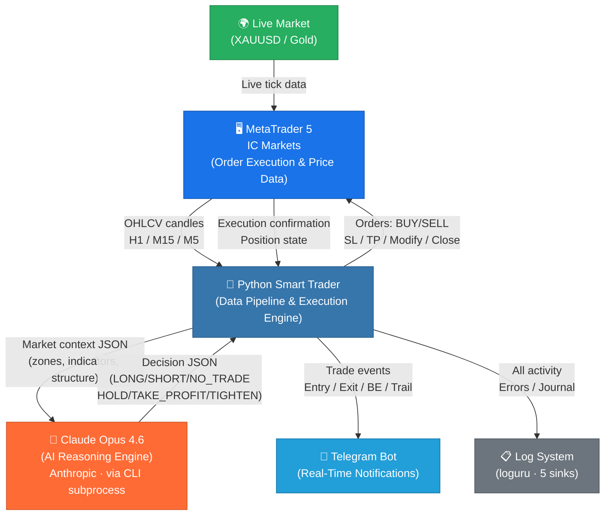
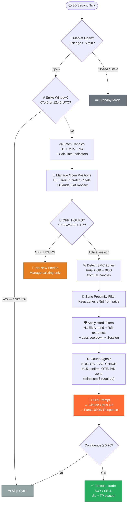
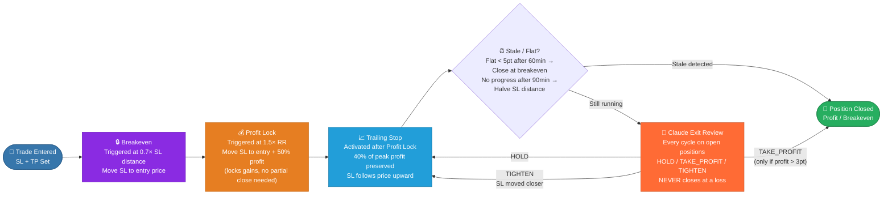
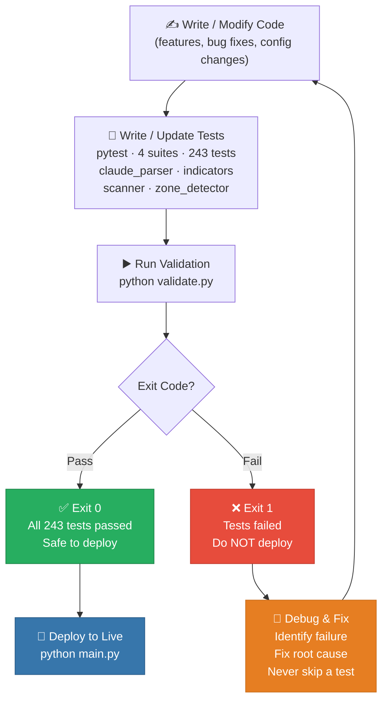

<div align="center">

# Smart Trader

### AI-Powered XAUUSD Trading Bot

> *"Let AI reason, let data execute."*

[](https://python.org)
[](https://anthropic.com)
[](https://metatrader5.com)
[](https://github.com)
[](https://github.com)

**Built by [Gifari K Suryo](mailto:gifari@suriota.id) — CEO & Founder, Lead R&D**
**PT Surya Inovasi Prioritas (SURIOTA) · Batam, Kepri, Indonesia**
**February 22, 2026**

</div>

---

## 📑 Table of Contents

- [Overview](#-overview)
- [Key Features](#-key-features)
- [System Architecture](#-system-architecture)
- [Trading Strategy](#-trading-strategy)
- [Scan Cycle Workflow](#-scan-cycle-workflow)
- [Exit Management](#-exit-management)
- [Validation Loop](#-validation-loop)
- [Installation](#-installation)
- [Configuration](#-configuration)
- [Usage](#-usage)
- [Project Structure](#-project-structure)
- [Performance & Risk](#-performance--risk)
- [Disclaimer](#-disclaimer)
- [License](#-license)
- [Author & Contact](#-author--contact)
- [Acknowledgements](#-acknowledgements)

---

## 🌟 Overview

**Smart Trader** is a fully autonomous algorithmic trading system built for the XAUUSD (Gold/USD) market. It fuses institutional-grade Smart Money Concepts (SMC) analysis with the reasoning power of **Claude Opus 4.6** — Anthropic's most advanced large language model — to deliver human-quality trade decisions at machine speed.

Unlike rule-based bots that blindly follow fixed signals, Smart Trader uses Claude as a live AI reasoning engine. Every potential trade is evaluated by Claude with full market context: zone quality, structure, momentum, session, and risk — before a single order is placed. The result is a system that thinks like an institutional trader and executes with the precision of software.

Live testing commences **February 23, 2026**. The system is currently in final pre-live validation on an IC Markets demo account.

---

## ✨ Key Features

- 🤖 **Claude Opus 4.6 as Decision Engine** — AI evaluates every entry and exit with full contextual reasoning, not just indicator crossovers
- 📊 **Smart Money Concepts (SMC)** — detects Fair Value Gaps (FVG), Order Blocks (OB), and Break of Structure (BOS) from H1 candles
- 🔄 **30-Second Scan Cycle** — continuous market monitoring with 11 layered validation steps
- 🛡️ **Multi-Stage Exit System** — Breakeven → Profit Lock → Trailing Stop → Scratch → Stale protection
- 📱 **Telegram Notifications** — real-time alerts for every trade event, scan result, and system status
- ✅ **243 Automated Tests** — full pytest validation suite before every deployment (exit code 0 = safe to deploy)
- 📈 **Session-Aware Trading** — prioritizes London (07:00-12:00 UTC) and New York (12:00-17:00 UTC) sessions
- 🔒 **Hard Risk Gates** — RSI extremes, spike windows, market-closed detection, and EMA trend filters prevent bad entries
- 📋 **Structured Logging** — 5 separate log sinks (activity, market, trades, journal, errors) via loguru
- 🏗️ **Clean Split Architecture** — Python handles data and execution; Claude handles reasoning — each does what it does best

---

## 🏛️ System Architecture



### Architecture Philosophy

The system is built on a deliberate **separation of concerns**:

| Layer | Component | Responsibility |
|-------|-----------|----------------|
| **Data** | `mt5_client.py` + `indicators.py` | Market data acquisition, technical computation |
| **Detection** | `zone_detector.py` + `scanner.py` | SMC zone identification, pre-filter |
| **Reasoning** | `claude_validator.py` + Claude Opus 4.6 | Trade decision, context synthesis |
| **Execution** | `executor.py` + `mt5_client.py` | Order management, position lifecycle |
| **Communication** | `telegram_notifier.py` | Stakeholder notifications |
| **Observability** | `logger_config.py` | Audit trail, debugging |

---

## 📐 Trading Strategy

Smart Trader is built on **Smart Money Concepts (SMC)** — the institutional approach to reading market structure. The core hypothesis is that large institutions (banks, hedge funds) leave detectable footprints in price action, and these footprints can be systematically identified and traded.

### Zone Types

| Zone | Description | Signal Strength |
|------|-------------|-----------------|
| 🟦 **Fair Value Gap (FVG)** | Three-candle imbalance where price moved aggressively, leaving an unfilled gap | High — institutions return to fill imbalance |
| 🟥 **Order Block (OB)** | Last bearish candle before a bullish impulse (or vice versa) — institutional accumulation zone | Very High — origin of strong moves |
| 🔷 **Break of Structure (BOS)** | Price breaks a prior swing high/low, confirming directional intent | Confirming — validates zone alignment |

### Entry Logic

```
H1 Structure Analysis → Zone Detection → Pre-Filter → Claude AI Decision
```

1. **H1 EMA(50) Trend** — establishes the macro bias (BULLISH / BEARISH / NEUTRAL). Counter-trend entries are blocked.
2. **Zone Proximity** — only zones within ≤ 5 points of current price qualify. Avoids reaching into stale zones.
3. **Hard Filters** — RSI > 85 blocks LONG entries; RSI < 15 blocks SHORT entries. Prevents buying exhaustion tops.
4. **Signal Count** — minimum 3 signals required from: BOS, OB, FVG, CHoCH, M15 confirmation, OTE, Premium/Discount zone.
5. **Claude Validation** — receives full JSON context (zones, indicators, structure, session, account state) and returns a structured decision with confidence score.
6. **Confidence Gate** — only trades where Claude returns `confidence >= 0.70` are executed.

### Claude as the Reasoning Engine

Claude Opus 4.6 receives a structured prompt containing:
- Active SMC zones (FVG, OB, BOS) with coordinates and strength ratings
- Technical indicators (RSI, ATR, EMA slope, MACD)
- Market structure state (trend, session, recent highs/lows)
- Account state (balance, equity, open positions)
- Risk parameters (max lot, SL distance, RR ratio)

Claude returns a structured JSON response:
```json
{
  "decision": "LONG",
  "confidence": 0.82,
  "reasoning": "Price retesting H1 OB at 2318.50 with BOS confirmation above 2324...",
  "sl_suggestion": 2315.00,
  "tp_suggestion": 2334.00
}
```

This architecture means the bot adapts to nuanced market conditions that rule-based systems cannot express.

---

## 🔄 Scan Cycle Workflow

The bot executes a complete market analysis cycle every **30 seconds**.



---

## 🚪 Exit Management

Smart Trader uses a layered, multi-stage exit system designed to protect capital while maximising profit capture. Risk management is fully automated — Claude's exit review is focused exclusively on profit optimisation, not stop-loss decisions.



### Exit Stage Summary

| Stage | Trigger | Action | Purpose |
|-------|---------|--------|---------|
| **Breakeven** | 0.7× SL distance in profit | Move SL to entry | Zero risk from this point |
| **Profit Lock** | 1.5× RR achieved | Move SL to entry + 50% profit | Guarantee minimum profit |
| **Trailing Stop** | After Profit Lock | SL follows at 40% of peak | Capture extended moves |
| **Scratch Exit** | Flat < 5pt after 60 min | Close at breakeven | Free up margin from dead trades |
| **Stale Tighten** | < 50% SL progress after 90 min | Halve remaining SL distance | Tighten before giving up |
| **Claude Exit** | Every scan cycle | HOLD / TAKE_PROFIT / TIGHTEN | AI profit optimisation |

---

## ✅ Validation Loop

Smart Trader enforces a strict **test-before-deploy** discipline. No code reaches a live account without passing the full validation suite.



### Test Suites

| Suite | File | Coverage |
|-------|------|----------|
| **Claude Parser** | `tests/test_claude_parser.py` | JSON response parsing, confidence extraction, malformed input handling |
| **Indicators** | `tests/test_indicators.py` | RSI, ATR, EMA computation, OTE zone, Premium/Discount detection |
| **Scanner** | `tests/test_scanner.py` | Zone proximity filter, session detection, signal counting logic |
| **Zone Detector** | `tests/test_zone_detector.py` | FVG, OB, BOS detection from H1 OHLCV data |

---

## ⚙️ Installation

### Prerequisites

- Python 3.13+
- MetaTrader 5 terminal (IC Markets or compatible broker)
- Claude Code CLI installed and authenticated (`claude` command available in PATH)
- Telegram Bot token and chat ID (optional, for notifications)

### Step-by-Step Setup

**1. Clone the repository**
```bash
git clone https://github.com/suriota/smart-trader.git
cd smart-trader
```

**2. Create and activate virtual environment**
```bash
python -m venv .venv

# Windows
.venv\Scripts\activate

# macOS / Linux
source .venv/bin/activate
```

**3. Install dependencies**
```bash
pip install -r requirements.txt
```

**4. Configure MetaTrader 5**

Ensure MetaTrader 5 is running and logged into your account. Smart Trader connects via the MT5 Python API automatically.

**5. Configure the bot**

Copy the example config and edit with your account details:
```bash
cp config/config.example.yaml config/config.yaml
```

Edit `config/config.yaml` — see the [Configuration](#-configuration) section below.

**6. Configure Claude CLI**

Ensure the `claude` command is available and authenticated:
```bash
claude --version
claude -p "test" --max-turns 1
```

**7. Run the validation suite**
```bash
python validate.py
```

Expected output:
```
Running Smart Trader validation suite...
243 passed in 4.32s
✅ All tests passed. Safe to deploy.
```

**8. Start the bot**
```bash
python main.py
```

---

## 🔧 Configuration

All bot behaviour is controlled via `config/config.yaml`. Key fields:

| Field | Default | Description |
|-------|---------|-------------|
| `mt5.login` | — | MT5 account login number |
| `mt5.server` | — | MT5 server name (e.g., `ICMarketsSC-Demo`) |
| `mt5.terminal_path` | — | Full path to `terminal64.exe` |
| `trading.symbol` | `XAUUSD` | Trading instrument |
| `trading.magic` | `202602` | Unique magic number for this bot's orders |
| `trading.comment` | `Opus-4.6` | Order comment shown in MT5 |
| `trading.fixed_lot` | `0.01` | Fixed lot size per trade |
| `trading.max_positions` | `1` | Maximum simultaneous open positions |
| `entry.min_confidence` | `0.70` | Minimum Claude confidence score to execute |
| `entry.min_signals` | `3` | Minimum SMC signal count required |
| `entry.zone_proximity_pt` | `5.0` | Max distance (points) from price to zone |
| `risk.sl_atr_multiplier` | `1.5` | Stop-loss distance as ATR multiplier |
| `risk.tp_atr_multiplier` | `3.0` | Take-profit distance as ATR multiplier |
| `exit.be_trigger_rr` | `0.7` | RR ratio to trigger breakeven move |
| `exit.profit_lock_rr` | `1.5` | RR ratio to trigger profit lock |
| `exit.trail_percent_peak` | `0.40` | Trailing stop as fraction of peak profit |
| `exit.scratch_minutes` | `60` | Minutes flat before scratch exit |
| `exit.stale_minutes` | `90` | Minutes with no progress before SL tighten |
| `session.off_hours_start` | `17` | UTC hour — no new entries after this |
| `session.off_hours_end` | `0` | UTC hour — entries allowed again |
| `telegram.token` | — | Telegram Bot API token |
| `telegram.chat_id` | — | Telegram chat/group ID (use `-100` prefix for supergroups) |
| `logging.level` | `INFO` | Log level (`DEBUG`, `INFO`, `WARNING`, `ERROR`) |
| `scan.interval_seconds` | `30` | Scan cycle interval in seconds |

---

## 🚀 Usage

### Run the bot
```bash
python main.py
```

The bot will:
1. Connect to MetaTrader 5
2. Verify account credentials
3. Begin the 30-second scan cycle
4. Send a `BOT STARTED` notification to Telegram
5. Log all activity to `logs/bot_activity.log`

### Validate before deployment
```bash
python validate.py
```

### Run tests only (without deployment check)
```bash
python -m pytest tests/ -v
```

### Run a single test suite
```bash
python -m pytest tests/test_indicators.py -v
python -m pytest tests/test_zone_detector.py -v
python -m pytest tests/test_scanner.py -v
python -m pytest tests/test_claude_parser.py -v
```

### View live logs
```bash
# Main activity log
tail -f logs/bot_activity.log

# Trades only
tail -f logs/trades.log

# Errors only
tail -f logs/errors.log
```

---

## 📁 Project Structure

```
smart_trader/
│
├── main.py                     # Entry point — scan loop orchestrator
├── validate.py                 # Pre-deploy validation runner
├── requirements.txt            # Python dependencies
│
├── config/
│   ├── config.yaml             # Main configuration (git-ignored)
│   └── config.example.yaml     # Template for new setups
│
├── src/
│   ├── mt5_client.py           # MT5 connection, candle fetch, order execution
│   ├── indicators.py           # RSI, ATR, EMA, OTE, Premium/Discount zone
│   ├── zone_detector.py        # FVG, OB, BOS detection from H1 candles
│   ├── scanner.py              # Zone proximity filter, session detection, risk filters
│   ├── claude_validator.py     # Prompt builder, Claude CLI caller, JSON parser
│   ├── executor.py             # Position lifecycle: BE, trail, scratch, stale, Claude exit
│   ├── telegram_notifier.py    # Trade event notifications via Telegram Bot API
│   └── logger_config.py        # loguru configuration — 5 separate log sinks
│
├── tests/
│   ├── test_claude_parser.py   # Claude response parsing tests
│   ├── test_indicators.py      # Indicator computation tests
│   ├── test_scanner.py         # Scanner filter and signal counting tests
│   └── test_zone_detector.py   # SMC zone detection tests
│
└── logs/                       # Runtime logs (git-ignored)
    ├── bot_activity.log        # Full activity trace
    ├── market.log              # Market data snapshots
    ├── trades.log              # Trade entries and exits
    ├── trade_journal.log       # Structured trade journal (CSV-friendly)
    └── errors.log              # Errors and exceptions only
```

---

## 📊 Performance & Risk

### Risk Management Philosophy

Smart Trader is built with **capital preservation as the primary objective**. The AI decision layer and the risk management layer are intentionally decoupled — Claude handles profit optimisation, automated systems handle loss containment.

| Risk Parameter | Value | Rationale |
|----------------|-------|-----------|
| **Risk per trade** | ~1% of account | Standard institutional risk unit |
| **Lot size** | Fixed 0.01 lot | Appropriate for $50–$500 balance |
| **Max open positions** | 1 | Prevents correlated drawdown |
| **SL method** | ATR-based | Adapts to current volatility |
| **Hard RSI gate** | > 85 / < 15 | Avoids extreme exhaustion entries |
| **Spike window block** | 07:45, 12:45 UTC | Avoids news-driven slippage |
| **Loss cooldown** | 30 minutes | Prevents revenge trading loop |
| **EMA trend filter** | H1 EMA(50) | Ensures macro alignment |
| **Confidence gate** | ≥ 0.70 | Only high-conviction setups |

### Capital Allocation Guidance

| Account Size | Recommended Lot | Monthly Target | Max Drawdown |
|-------------|-----------------|----------------|--------------|
| $100 | 0.01 (fixed) | Variable | ~5–10% |
| $500 | 0.01–0.05 | Variable | ~5–10% |
| $1,000+ | Switch to `percent_balance` method | Variable | ~5–10% |

> **Note**: Past performance in backtesting and demo environments does not guarantee future results in live markets. All figures are illustrative only.

---

## ⚠️ Disclaimer

This software is provided **for educational and research purposes only**.

- Smart Trader is **not financial advice**
- Trading in financial markets, including XAUUSD (Gold), involves **substantial risk of loss** and may not be suitable for all investors
- Past performance — including backtest results — **does not guarantee future results**
- You should **never trade with money you cannot afford to lose**
- This bot interacts with live broker accounts and **can execute real trades** — ensure you fully understand its behaviour before running on a live account
- PT Surya Inovasi Prioritas (SURIOTA) and the author(s) accept **no liability** for any financial losses incurred through the use of this software
- Always conduct your own due diligence and consult a qualified financial advisor before making investment decisions

---

## 📜 License

```
Copyright © 2026 PT Surya Inovasi Prioritas (SURIOTA)
All Rights Reserved.

PROPRIETARY AND CONFIDENTIAL

This software and its source code are the exclusive intellectual property of
PT Surya Inovasi Prioritas (SURIOTA). Unauthorised copying, reproduction,
modification, distribution, or use of this software, in whole or in part,
via any medium, is strictly prohibited without the prior written consent of
PT Surya Inovasi Prioritas (SURIOTA).

For licensing inquiries, contact: legal@suriota.id
```

---

## 👤 Author & Contact

<div align="center">

| | |
|---|---|
| **Name** | Gifari K Suryo |
| **Role** | CEO & Founder, Lead R&D |
| **Company** | PT Surya Inovasi Prioritas (SURIOTA) |
| **Location** | Batam, Kepri, Indonesia 🇮🇩 |
| **Email** | [gifari@suriota.id](mailto:gifari@suriota.id) |
| **Project Initiated** | February 22, 2026 |
| **Live Testing Start** | February 23, 2026 |

</div>

---

## 🙏 Acknowledgements

Smart Trader was made possible by the exceptional technology of these organisations:

- 🤖 **[Anthropic](https://anthropic.com)** — for Claude Opus 4.6, the AI reasoning engine at the heart of this system. The Claude Code CLI enabled seamless subprocess integration between Python and the AI layer.
- 🖥️ **[MetaTrader 5 / MetaQuotes](https://metatrader5.com)** — for the industry-standard trading terminal and Python API that powers all market data acquisition and order execution.
- 🏦 **[IC Markets](https://icmarkets.com)** — for providing a reliable, low-latency demo and live trading environment with tight XAUUSD spreads, ideal for algorithmic strategy development.

---

<div align="center">

**Smart Trader · v1.0.0-beta**
*Built with precision. Reasoned by AI. Executed with discipline.*

**PT Surya Inovasi Prioritas (SURIOTA) · Batam, Kepri, Indonesia · 2026**

</div>
