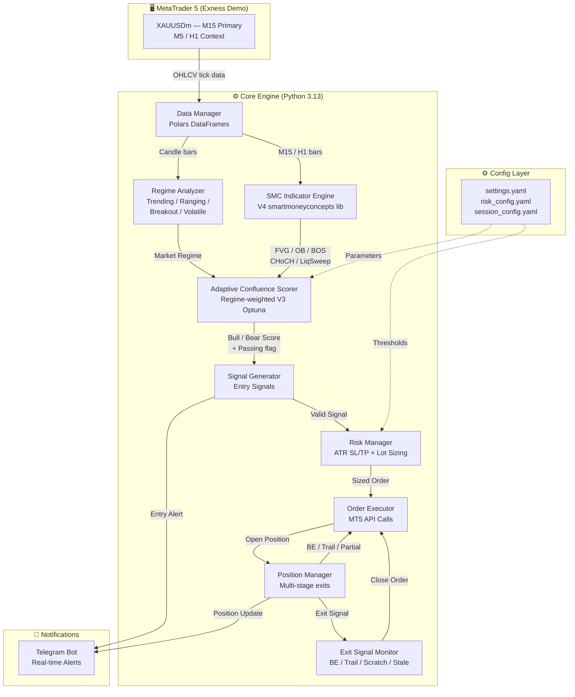
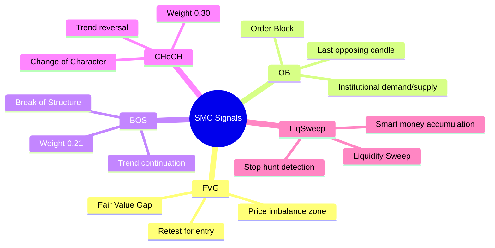
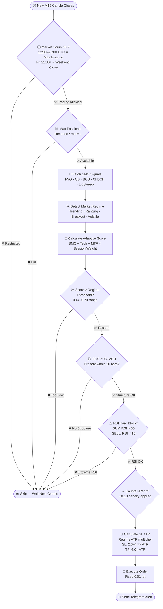
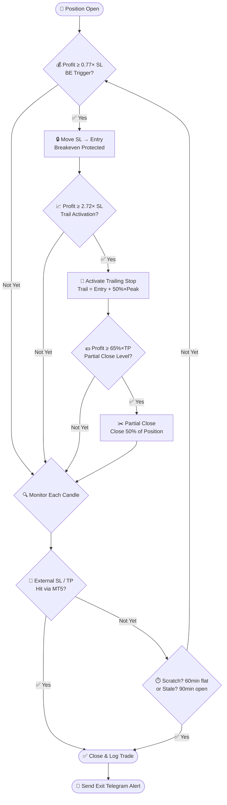
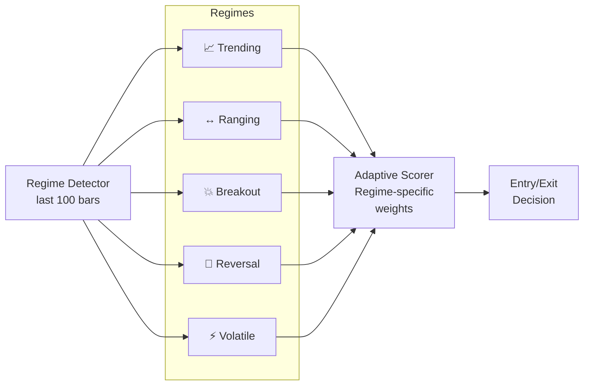

<div align="center">

# ⚡ XAUUSD SMC Trading Bot

**Professional Algorithmic Trading System — Gold / USD**

[](CHANGELOG.md)
[](https://www.python.org/)
[](https://www.metatrader5.com/)
[](CHANGELOG.md)
[](LICENSE)
[](https://www.anthropic.com/)

> **Intelligent rules-based trading system for XAUUSD (Gold/USD) leveraging Smart Money Concepts (SMC), regime-adaptive confluence scoring, and multi-stage position management — built and operated by [PT Surya Inovasi Prioritas (SURIOTA)](https://suriota.id).**

---

*"Trade like the institutions do — follow the smart money."*

</div>

---

## 📋 Table of Contents

1. [About the Project](#-about-the-project)
2. [Performance Summary](#-performance-summary)
3. [System Architecture](#-system-architecture)
4. [Strategy: Smart Money Concepts](#-strategy-smart-money-concepts)
   - [SMC Components](#smc-components)
   - [Entry Logic](#entry-logic-flowchart)
   - [Exit & Position Management](#exit--position-management-flowchart)
5. [Regime-Adaptive Engine](#-regime-adaptive-engine)
6. [Session Strategy](#-session-strategy)
7. [Risk Management](#-risk-management)
8. [Tech Stack](#-tech-stack)
9. [Project Structure](#-project-structure)
10. [Quick Start](#-quick-start)
11. [Configuration](#-configuration)
12. [TradingView Visual Reference](#-tradingview-visual-reference)
13. [Roadmap](#-roadmap)
14. [Disclaimer](#-disclaimer)
15. [License & Copyright](#-license--copyright)

---

## 🎯 About the Project

XAUUSD SMC Trading Bot is a fully automated algorithmic trading system designed for professional Gold (XAUUSD) trading. The system operates on **MetaTrader 5** via Python API, scanning the **M15 timeframe** continuously and executing high-probability trade setups based on Smart Money Concepts.

### What Makes It Different

| Feature | Description |
|--------|-------------|
| 🧠 **Regime-Adaptive** | Parameters dynamically shift across 5 market regimes: Trending, Ranging, Breakout, Reversal, Volatile |
| 📊 **V4 SMC Library** | Uses `smartmoneyconcepts` Python library for institutional-grade indicator detection |
| 🔢 **Optuna-Optimized** | 25-trial walk-forward optimization across 3 time windows (not curve-fitted) |
| 🛡️ **Multi-Stage Exit** | Breakeven → Dynamic Partial Close → Trailing Stop — maximizes winners |
| 📱 **Telegram Alerts** | Real-time trade notifications, scan reports, and performance summaries |
| ⚡ **Pure Python** | No third-party signal services — 100% in-house rules-based logic |

### Who Built This

Built and operated by the **Research & Development Division** of **PT Surya Inovasi Prioritas (SURIOTA)**.

- **Lead R&D**: Gifari K Suryo — CEO & Founder, PT Surya Inovasi Prioritas
- **AI Development Partner**: Claude Sonnet 4.6 (Anthropic)
- **Development Period**: February 2026
- **Testing Started**: 23 February 2026 (Exness Demo, XAUUSDm)

---

## 📈 Performance Summary

> Results from backtesting on XAUUSDm historical data (M15 timeframe). Demo live testing begins **23 February 2026**.

### Backtest Results Comparison

| Version | Strategy | Profit Factor | Win Rate | Max Drawdown | Net Return | Trades |
|---------|----------|:-------------:|:--------:|:------------:|:----------:|:------:|
| **V4** (current) | SMC Library + V3 Adaptive | **1.96** | **65.78%** | — | — | — |
| **V3 Full** | All Signals ON | 1.12 | 51.5% | 12.80% | +13.63% | 478 |
| **V3 Optimized** | BOS-Only (Optuna) | 1.33 | 56.2% | 6.24% | +31.89% | — |
| V2 | Fixed Weights | < 1.12 | < 51% | > 12% | — | — |

> ⚠️ **Note:** V3 Optimized (BOS-only) results may reflect overfitting; V4 with all signals ON is the production config. Walk-forward validation applied on V3.

### Current Performance Targets (Live)

| Metric | Target | Status |
|--------|--------|--------|
| Profit Factor | ≥ 1.5 | 🔄 Testing |
| Win Rate | ≥ 55% | 🔄 Testing |
| Max Drawdown | ≤ 10% | 🔄 Testing |
| Average R:R | ≥ 1:2 | 🔄 Testing |
| Daily Trades | 1–5 | 🔄 Testing |

---

## 🏗️ System Architecture



---

## 📊 Strategy: Smart Money Concepts

### SMC Components

The bot detects **5 core SMC signals** on every M15 candle:



| Signal | Weight | What It Detects | Entry Condition |
|--------|:------:|-----------------|-----------------|
| 🟦 **FVG** (Fair Value Gap) | 0.20 | Market imbalance — 3-candle gap | Price retesting into gap zone |
| 🟩 **Order Block** | 0.25 | Last opposing candle before strong move | Price returning to OB zone |
| 🔵 **Liquidity Sweep** | 0.20 | Stop hunt below/above swing points | Price sweeps then reverses |
| 🟡 **CHoCH** (Change of Character) | 0.30 | Trend reversal break | Recent (≤ 20 bars) |
| 🟠 **BOS** (Break of Structure) | 0.21 | Trend continuation break | Recent (≤ 20 bars) |

> **Plus technical confirmations:** EMA alignment (0.10), RSI (0.08), MACD (0.07), H1 MTF bonus (0.10)

---

### Entry Logic Flowchart



---

### Exit & Position Management Flowchart



---

## 🧬 Regime-Adaptive Engine

The **AdaptiveConfluenceScorer** detects 5 distinct market regimes and adjusts all parameters accordingly. Parameters are the result of **Optuna hyperparameter optimization** (25 trials, 3-window walk-forward).



### Regime Parameters (V3 Optuna-Optimized)

| Regime | Min Confluence | Min SMC Signals | SL Multiplier | TP Multiplier |
|--------|:--------------:|:---------------:|:-------------:|:-------------:|
| 📈 **Trending** | 0.437 | 1 | 2.60× ATR | 6.0× ATR |
| ↔️ **Ranging** | 0.550 | 3 | 4.66× ATR | 6.0× ATR |
| 💥 **Breakout** | 0.614 | 3 | 4.26× ATR | 6.0× ATR |
| 🔄 **Reversal** | 0.589 | 2 | 4.39× ATR | 6.0× ATR |
| ⚡ **Volatile** | 0.704 | 3 | 4.57× ATR | 6.0× ATR |

---

## ⏰ Session Strategy

Trading performance is weighted by session quality. Exness-specific market hours are respected.

| Session | UTC Hours | Weight | Signal Quality | Status |
|---------|-----------|:------:|:--------------:|:------:|
| 🟢 **London–NY Overlap** | 13:00–16:00 | 1.18× | Excellent — Best XAUUSD movement | ✅ Active |
| 🟡 **London** | 08:00–16:00 | 1.16× | High — Strong institutional activity | ✅ Active |
| 🟡 **New York** | 13:00–22:00 | 1.16× | High — High volatility & liquidity | ✅ Active |
| 🟠 **Asian** | 00:00–08:00 | 0.75× | Lower — Still tradeable | ✅ Active |
| 🔴 **Maintenance** | 22:00–23:00 | — | Blackout — Exness XAUUSDm gap | ❌ Blocked |
| 🔴 **Friday Close** | Fri 21:30+ | — | Weekend close preparation | ❌ Blocked |

> Session weights are applied as score multipliers: `effective_threshold = min_confluence / session_weight`
> Higher weight = lower effective threshold = easier to qualify signal in premium hours.

---

## 🛡️ Risk Management

### Position Sizing

| Parameter | Value | Notes |
|-----------|:-----:|-------|
| Method | Fixed | `method: "fixed"` |
| Lot Size | **0.01** | ~$51 margin at 1:100, $100 balance |
| Max Positions | **1** | Exness demo margin constraint |
| Max Total Lots | **0.01** | Single position maximum |

### Exit Stages

| Stage | Trigger | Action |
|-------|---------|--------|
| 🔒 **Breakeven** | Profit ≥ **0.77× SL** distance | Move SL to entry price |
| ✂️ **Partial Close** | Profit ≥ **max(TP×0.65, 1.0R)** | Close 50% of position |
| 🎯 **Trailing Stop** | Profit ≥ **2.72× SL** | Trail = entry + 50% of peak |
| 🏁 **Full Take Profit** | Hits TP level | Full close |
| ⏱️ **Scratch Close** | 60 min flat / no progress | Close near entry |
| 🧹 **Stale Close** | Position open 90 min | Close if price hasn't moved |

### Account Protection

| Rule | Value |
|------|:-----:|
| Max Daily Loss | 5.0% |
| Max Weekly Loss | 10.0% |
| Max Drawdown (emergency stop) | 15.0% |
| Consecutive losses pause | 3 trades → 60 min cooldown |
| Post-SL directional cooldown | 2 candles (30 min) same direction |
| Emergency stop file | `EMERGENCY_STOP.txt` |

---

## 🔧 Tech Stack

| Component | Technology | Version | Role |
|-----------|-----------|:-------:|------|
| 🐍 **Runtime** | Python | 3.13+ | Core execution |
| 📊 **Trading Platform** | MetaTrader 5 | 5.0.45+ | Order execution & data feed |
| ⚡ **Data Processing** | Polars | 0.20+ | High-performance DataFrame ops |
| 📡 **SMC Library** | smartmoneyconcepts | 0.0.26+ | V4 institutional indicator detection |
| 🔧 **Technical Indicators** | pandas-ta / ta | — | RSI, EMA, MACD, ATR |
| 📝 **Logging** | Loguru | 0.7+ | Structured logging with rotation |
| ⚙️ **Config** | PyYAML + python-dotenv | — | YAML config + .env secrets |
| 🧪 **Optimization** | Optuna | 3.5+ | Hyperparameter optimization |
| 📱 **Notifications** | Telegram Bot API | — | Real-time trade alerts |
| 🧪 **Testing** | pytest + pytest-cov | — | Unit & integration tests |
| 🤖 **AI Assistant** | Claude Sonnet 4.6 | — | Code development & review |

---

## 📁 Project Structure

```
xauusd_trading_bot/
│
├── 🚀 main.py                     # Entry point — start bot here
├── 📋 README.md                   # This file
├── 📦 requirements.txt            # Python dependencies
├── 🔐 .env                        # Secrets (MT5 credentials, Telegram token)
├── 🔐 .env.example                # Template for .env
│
├── ⚙️  config/                    # All configuration files
│   ├── settings.yaml              # Main bot config (SMC version, regime weights)
│   ├── risk_config.yaml           # SL/TP, position sizing, account protection
│   ├── session_config.yaml        # Session weights & blackout hours
│   ├── mt5_config.yaml            # MetaTrader 5 connection
│   ├── regime_profiles.yaml       # Regime detection parameters
│   └── trading_rules.yaml         # Entry/exit rules
│
├── 🧠 src/                        # All source code
│   ├── bot/                       # Main bot controller
│   │   ├── trading_bot.py         # Main loop & orchestration
│   │   ├── decision_engine.py     # Signal → order decision
│   │   └── health_monitor.py      # MT5 health & reconnection
│   ├── indicators/                # SMC & technical indicators
│   │   ├── smc_v4_adapter.py      # V4 smartmoneyconcepts adapter
│   │   ├── smc_indicators.py      # V3 custom SMC detectors
│   │   ├── fvg_detector.py        # Fair Value Gap
│   │   ├── order_block_detector.py # Order Block
│   │   ├── liquidity_detector.py  # Liquidity Sweep
│   │   ├── structure_detector.py  # BOS / CHoCH
│   │   └── technical.py           # RSI, EMA, MACD, ATR
│   ├── analysis/                  # Market analysis
│   │   ├── adaptive_scorer.py     # Regime-adaptive confluence scorer (V3)
│   │   ├── market_analyzer.py     # Regime detection & market conditions
│   │   └── mtf_analyzer.py        # Multi-timeframe analysis
│   ├── strategy/                  # Strategy logic
│   │   ├── entry_signals.py       # Entry gate checks
│   │   ├── exit_signals.py        # Exit conditions
│   │   ├── smc_strategy.py        # Strategy orchestrator
│   │   └── signal_validator.py    # Signal validation
│   ├── risk_management/           # Risk engine
│   ├── position_management/       # Position tracker & manager
│   ├── execution/                 # Order executor & emergency handler
│   ├── sessions/                  # Session detection & filtering
│   ├── notifications/             # Telegram notifier
│   └── core/                      # MT5 connector, data manager, constants
│
├── 🛠️  scripts/                   # Developer & operational tools
│   ├── run_backtest.py            # Run historical backtest
│   ├── run_optimization_v3.py     # Optuna parameter optimization
│   ├── run_v4_comparison.py       # V3 vs V4 comparison
│   ├── debug_signals.py           # Signal debugging
│   ├── diagnose_signals.py        # Signal pipeline diagnostics
│   ├── check_account.py           # MT5 account status
│   ├── validate_deploy.py         # Pre-deployment validation
│   ├── start_bot_loop.sh          # Bot process manager (shell)
│   └── stop_bot.sh                # Clean bot stop (shell)
│
├── 📚 docs/                       # Documentation & references
│   ├── XAUUSD_SMC_Bot.pine        # TradingView Pine Script (visual reference)
│   ├── OPTIMIZATION_GUIDE.md      # Optuna optimization walkthrough
│   └── OPTIMIZATION_STATUS.md     # Optimization run history
│
├── 📊 data/                       # Data storage
│   ├── market_history/            # OHLCV candle data
│   ├── trade_history/             # Trade records
│   ├── optimization_v3/           # V3 Optuna results
│   │   └── optimized_config_v3.yaml
│   └── v4_comparison/             # V3 vs V4 backtest results
│
├── 📋 logs/                       # Runtime logs
│   ├── bot_activity/              # General bot operation
│   ├── trades/                    # Trade execution records
│   ├── market/                    # Market data snapshots
│   └── errors/                    # Error logs
│
└── 🧪 tests/                      # Test suite
```

---

## 🚀 Quick Start

### Prerequisites

- Python 3.13+
- MetaTrader 5 terminal installed and running
- Active demo or live MT5 account (Exness or compatible broker)
- Telegram bot token (optional, for alerts)

### Installation

```bash
# 1. Clone / navigate to the project
cd xauusd_trading_bot

# 2. Create virtual environment
python -m venv venv
source venv/bin/activate       # Linux/Mac
# venv\Scripts\activate        # Windows

# 3. Install dependencies
pip install -r requirements.txt

# 4. Configure environment
cp .env.example .env
# Edit .env with your MT5 credentials and Telegram token

# 5. Validate MT5 connection
python scripts/test_mt5_connection.py

# 6. Run pre-deployment checks
python scripts/validate_deploy.py
```

### Run the Bot

```bash
# Demo mode (recommended first run)
python main.py --mode demo -y

# Live mode
python main.py --mode live -y
```

> ⚠️ **Always start with demo mode. Never run multiple instances simultaneously.**

### Emergency Stop

Drop a file named `EMERGENCY_STOP.txt` in the root directory to immediately halt the bot:

```bash
# Windows
echo stop > EMERGENCY_STOP.txt

# Linux/Mac
touch EMERGENCY_STOP.txt
```

---

## ⚙️ Configuration

All configuration lives in the `config/` directory. No hardcoded values in source code.

### Key Configuration Files

| File | Purpose | Key Settings |
|------|---------|-------------|
| `settings.yaml` | Master config | `use_smc_v4`, `use_adaptive_scorer`, `regime_weights`, `telegram` |
| `risk_config.yaml` | Risk engine | `fixed_lot`, `atr_multiplier`, `exit_stages`, `account_protection` |
| `session_config.yaml` | Session weights | `blackout_hours`, `friday_close_time_utc`, session weights |
| `mt5_config.yaml` | MT5 connection | Login, server, terminal path |
| `trading_rules.yaml` | Entry rules | `require_structure_support`, `require_fvg_or_ob`, `min_confluence_score` |

### Enable/Disable SMC Version

```yaml
# config/settings.yaml
use_smc_v4: true          # true = V4 smartmoneyconcepts library
use_adaptive_scorer: true  # true = V3 regime-adaptive scoring
```

### Telegram Setup

```yaml
# config/settings.yaml
telegram:
  enabled: true
  token: "YOUR_BOT_TOKEN"
  chat_id: "-1003XXXXXXXXX"  # Use -100 prefix for supergroups
```

---

## 📺 TradingView Visual Reference

A synchronized **Pine Script** is available at `docs/XAUUSD_SMC_Bot.pine`.

This script mirrors the exact bot logic visually on TradingView charts:
- All SMC zones (FVG boxes, OB boxes, swing points)
- BOS/CHoCH labels
- Session backgrounds (with maintenance & Friday close markers)
- Confluence score, regime threshold, entry signals
- Trail stop, partial close level, BE trigger level
- Info table with live score breakdown

**To use:** Copy contents of `docs/XAUUSD_SMC_Bot.pine` into TradingView → Pine Script Editor → Add to chart (XAUUSDm, M15).

---

## 🗺️ Roadmap

### ✅ Completed (v1.0 – v4.0)

- [x] MT5 integration & live data feed
- [x] SMC indicators: FVG, Order Block, Liquidity Sweep, BOS, CHoCH
- [x] Multi-timeframe analysis (M1, M5, M15, H1)
- [x] V3 regime-adaptive confluence scorer
- [x] Optuna hyperparameter optimization (25 trials, walk-forward)
- [x] Multi-stage exits: BE → Partial Close → Trailing Stop
- [x] V4 SMC library integration (smartmoneyconcepts)
- [x] Telegram notifications (entry, exit, BE, partial, heartbeat)
- [x] Exness XAUUSDm migration (symbol, maintenance, Friday close)
- [x] TradingView Pine Script visual reference (synchronized)
- [x] Session-adaptive scoring (V3 Optuna weights)
- [x] Counter-trend penalty & directional cooldown

### 🔄 In Progress (v4.1+)

- [ ] Live demo testing & performance validation (starts 2026-02-23)
- [ ] Real-time performance dashboard
- [ ] Automated trade journaling to Google Sheets

### 📅 Planned (v5.0+)

- [ ] Machine learning regime predictor (XGBoost / LSTM hybrid)
- [ ] News sentiment filter (economic calendar integration)
- [ ] Multi-symbol expansion (XAGUSD, EURUSD)
- [ ] Portfolio-level risk management
- [ ] Web dashboard (React + FastAPI)
- [ ] Live account deployment (post demo validation)

---

## ⚠️ Disclaimer

> **Trading in financial markets involves significant risk of loss. This software is provided for educational and research purposes.**

- This system is operated exclusively on **demo accounts** during the testing phase
- Past backtesting performance **does not guarantee future results**
- Always use proper risk management — never risk more than you can afford to lose
- The authors and PT Surya Inovasi Prioritas are **not licensed financial advisors**
- This project does **not constitute financial advice or investment recommendations**
- Users are solely responsible for their own trading decisions

---

## 📜 License & Copyright

```
Copyright © 2026 PT Surya Inovasi Prioritas (SURIOTA)
All Rights Reserved.

Proprietary and Confidential.
Unauthorized copying, modification, distribution, or use of this software,
in whole or in part, is strictly prohibited without prior written permission
from PT Surya Inovasi Prioritas.
```

**Author & Lead Developer:**
> **Gifari K Suryo**
> CEO & Founder — PT Surya Inovasi Prioritas (SURIOTA)
> Lead Research & Development
> Batam, Kepulauan Riau, Indonesia

**AI Development Partner:**
> Built with assistance from [Claude Sonnet 4.6](https://www.anthropic.com/claude) (Anthropic)

---

<div align="center">

**PT Surya Inovasi Prioritas (SURIOTA)**

*Innovating Tomorrow's Solutions Today*

---

[](https://www.python.org/)
[](https://www.metatrader5.com/)
[](https://www.anthropic.com/)

*© 2026 PT Surya Inovasi Prioritas. All Rights Reserved.*

</div>
